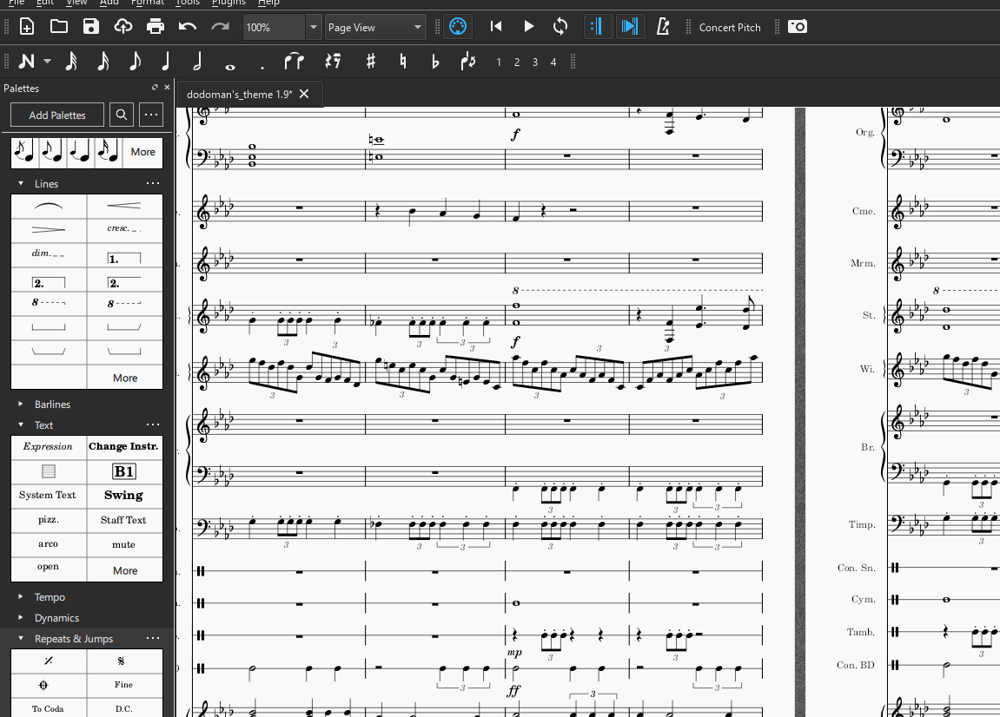

[← Back to Blogs](/blog)

As one of my earlier interests, composing unfolded quite naturally for me as I learned music theory, piano repertoire, and performance in a band. I've also met some friends who were exceptionally talented in music performance and production to give me tips. Although I'm definetely not their best students, I've entertained myself for quite a few hours working on pieces of my own. I work with usually orchestral instrumentation or piano. I use Musescore for writing and rendering, however the audio and performance quality of muescore pales in comparison to the newer and paid softwares. 

{:width="500px" height="500px"}

## Dodoman's Theme

This peice took me around 40 hours to compose over 4 months and I consider it to be my magnum opus thus far. It takes inspiration from Schubert Ständchen, Luigi's mansion and Kisame's Theme. It's not quite completely refined as I'm still seeking better alternatives to the 2nd movements and the ending. The transitions between the movements could also use work as well as further instrument volume balancing. 

<html>
<body>
  <audio controls>
    <source src="../assets/audio/dodoman_theme.mp3" type="audio/mpeg">
    Your browser does not support the audio element.
  </audio>
</body>
</html>

## 8 bit nostalgia

This piece originally written for solo piano has been switched over to a synthesizer. For some reason the melody, chord progression and synthesizer work well together in making it feel nostalgic. The easter egg ending uses a motif from guilty crown. 

<html>
<body>
  <audio controls>
    <source src="../assets/audio/8_bit_nostalgia.mp3" type="audio/mpeg">
    Your browser does not support the audio element.
  </audio>
</body>
</html>

## 3 Hands Unknown

This 3 handed piece's motif is built off an unknown piece in past memories. The chord progresion is also inspired by another unknown piece. I had transcribed this without reference, but I had a clear idea in my head on what I wanted the chords to sound like as if I heard it before. If you know any reference material that sounds similar, let me know- I'm curious!

<html>
<body>
  <audio controls>
    <source src="../assets/audio/4hand_remix.mp3" type="audio/mpeg">
    Your browser does not support the audio element.
  </audio>
</body>
</html>

## Game OST 4

This is orchestral piece was inspired by Sonny 2 music with new instrumentation, counter melody and progression. The full piece is still in the works. 

<html>
<body>
  <audio controls>
    <source src="../assets/audio/Game_OST_4.mp3" type="audio/mpeg">
    Your browser does not support the audio element.
  </audio>
</body>
</html>

## Puddings day off

This is a bit of an experimental piece. It follows the day of the life of Pudding, my rabbit. It starts off tense for Pudding as today is vacuum day. Things suddenly calm down when the cleaning finishes. Immediately Pudding is no longer afraid. She flips over and takes a nap in the sun as her enemies are taken away to the basement (the vacuum).

<html>
<body>
  <audio controls>
    <source src="../assets/audio/Puddings_day_off.mp3" type="audio/mpeg">
    Your browser does not support the audio element.
  </audio>
</body>
</html>

## Spooky Noises

Even more experimental, I'm looking into ways to create tension and stress. Whether it would be for my animation or for a horror video game, this is a field I haven't studied much in. I'm looking into the words of Danny Elfman, Bernard Herrman and Krzystof Penderecki. This particular snippet is inspired also from Attack on Titan. 

<html>
<body>
  <audio controls>
    <source src="../assets/audio/spooky_noise.mp3" type="audio/mpeg">
    Your browser does not support the audio element.
  </audio>
</body>
</html>

## Game OST 2

This is one of the first orchestral pieces I've attempted. It draws inspiration from Vellum's OST as the primary chord progression and Temple of Time OST for certain rhythms. 

<html>
<body>
  <audio controls>
    <source src="../assets/audio/Game_OST_3.mp3" type="audio/mpeg">
    Your browser does not support the audio element.
  </audio>
</body>
</html>

## March of the clowns

My first multi-instrument piece made when I was 13. It was themed with clownery and tom foolery. I tried to use shorter notes and chromatic scales that resemble Entry of the Gladiators' chromatic melody, one of the most iconic pieces for circus music. 

<html>
<body>
  <audio controls>
    <source src="../assets/audio/March_of_the_clowns.mp3" type="audio/mpeg">
    Your browser does not support the audio element.
  </audio>
</body>
</html>

## Shrekesque

I love the theme used in shrek here. I don't rememebr exactly where it was played, but I believe this version is similar to the original as this is a more of a transcription than a composition. I have yet to elaborate and evolve it past it's starting point, but I'm leaving it here anyways. 

<html>
<body>
  <audio controls>
    <source src="../assets/audio/shrekesque.mp3" type="audio/mpeg">
    Your browser does not support the audio element.
  </audio>
</body>
</html>

## Kanada

I wanted to see if I could transcribe O canada like I heard it in elementary school. This was an attempt to try to imitate this unknown O canada version that was stuck in my head although I've definetely went off the script and added parts of my own too. 

<html>
<body>
  <audio controls>
    <source src="../assets/audio/Kanada.mp3" type="audio/mpeg">
    Your browser does not support the audio element.
  </audio>
</body>
</html>

## Violin nostalgia

I don't know why this sounds so nostalgic to me. It draws inspiration from Joe Hisashi's descending piano chords. 

<html>
<body>
  <audio controls>
    <source src="../assets/audio/violin_nostalgia.mp3" type="audio/mpeg">
    Your browser does not support the audio element.
  </audio>
</body>
</html>

## Sadge in C

Another Synth piece that emphasizes the uses of sustain to give the piece a blurry, longing feel. It's incomplete and currently ends in the middle of a spicy transition

<html>
<body>
  <audio controls>
    <source src="../assets/audio/sadgeC.mp3" type="audio/mpeg">
    Your browser does not support the audio element.
  </audio>
</body>
</html>
