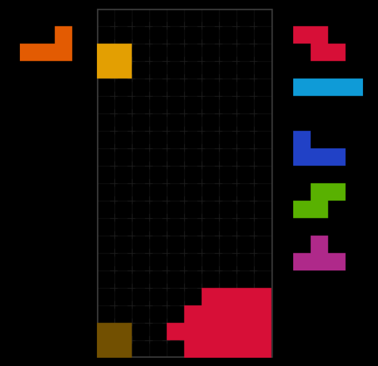
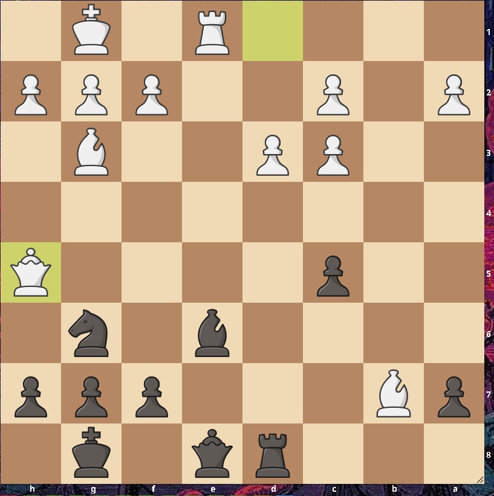

<a href="/personal/blog" style="position: fixed; bottom: 20px; right: 20px; background-color: #6495ED; color: white; padding: 10px 15px; text-decoration: none; border-radius: 5px;">← Back</a>

## Make Bill Nye Proud: General Science Knowledge

<button id="quiz-toggle-button" onclick="toggleQuizPopup()">Show Quiz</button>

  

    <h2>General Science Knowledge Quiz</h2>
    
Select the correct answers by clicking on the options. You can start the quiz by pressing "Show Quiz"!

    

      <!-- The quiz questions will be dynamically added here -->
    

  

## Tetris Puzzles

A surprisingly hard puzzle that may arise from PCO

[Play it yourself!](https://jstris.jezevec10.com/?play=6&map=51132)

{:width="300px" height="400px"}

  <button onclick="toggleSpoiler('tetrisSpoiler1')">Show/Hide Hint</button>
  

    Piece order: O L I Z S. Three of the pieces need to be spun in.
  

## Chess Puzzles

Difficulty: 2100

{:width="400px" height="400px"}

  <button onclick="toggleSpoiler('chessSpoiler1')">Show/Hide Solution</button>
  

    1... Bg4 2. Rxe8+ Rxe8 3. h3 Bxh5 4. Bd6 Nf8 5. Bxc5 Rb8 6. Bd5 Rb5 7. d4 Nd7 8. c4 Rb1+ 9. Kh2
  

## Logic Puzzles

WIP

## Visual Puzzles

WIP

## Naruto Quiz

WIP

## 2 Truths 1 Lie

I am currently trying to come up with lies
