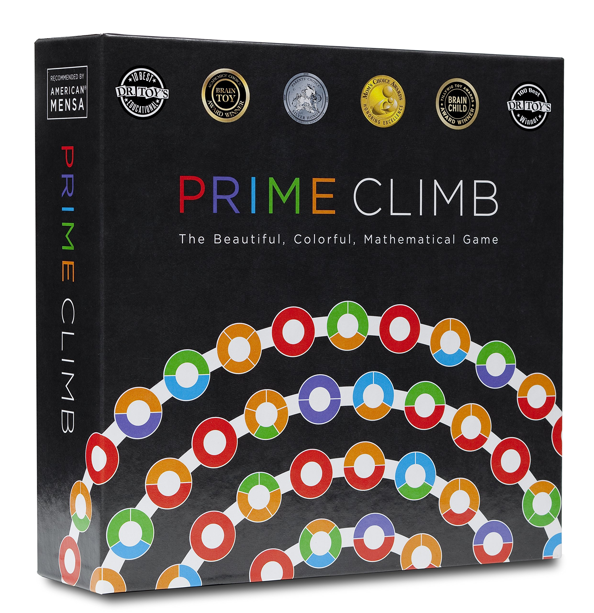
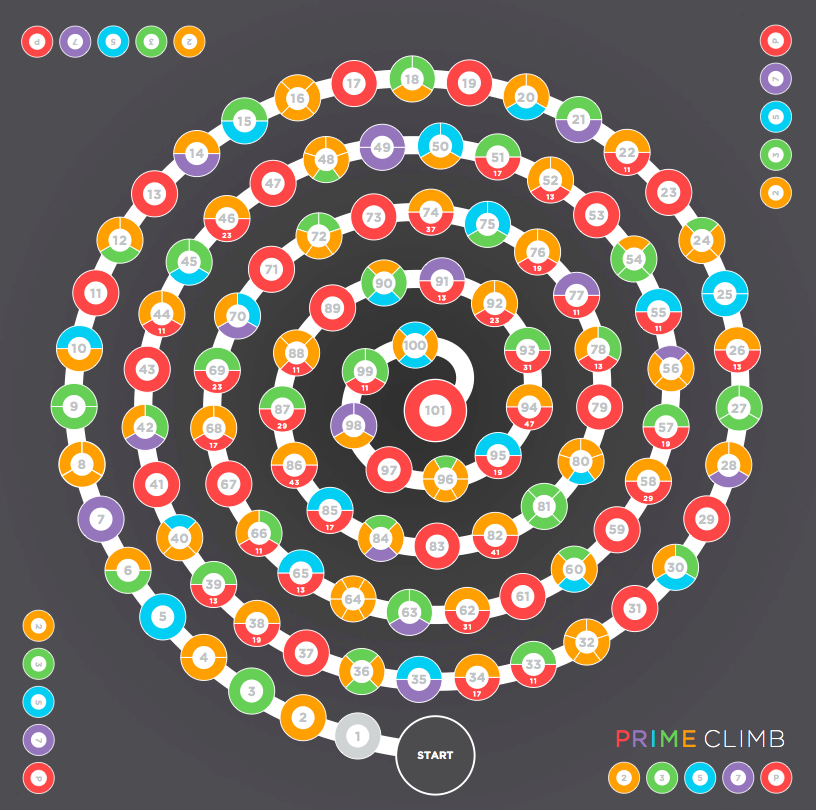

<a href="/personal/blog" style="position: fixed; bottom: 20px; right: 20px; background-color: #6495ED; color: white; padding: 10px 15px; text-decoration: none; border-radius: 5px;">← Back</a>

# Solving Prime Climb

## What is prime climb?

{:width="300px" height="300px"}

Primeclimb is a math based board game with the goal of getting 2 of your pieces from 0 to exactly 101 before everyone else. It uses arithmetic on the numbers on two dice rolls as a form of movement. These dice are numbered from 1 - 10, and operations include addition, multiplcation subtraction and division. 

## Rules

{:width="300px" height="300px"}

This is the  board of which the game is played. We will simplify the game's rules to only the rolling and moving aspect.

[Here are the full rules if you're interested](https://mathforlove.com/2010/01/prime-climb-rules/)

## Naive approach

When this game is first presented to players, the typical gameplan involves each player maximizing the incraese in their piece's sum per turn. This usually involves multiplying their pieces until further multiplication is impossible due to results being above 101. They would then proceed to continuously add rolls until 101. Near 101, they may be forced to subtract due to needing to reach 101 exactly. 

### Why is this ineffective?

Due to the fact that half of the map requires addition (51 -> 100) to move up, it's rarely effective to enter the range of 51 -> 80. The overall flaw of the plan is that it's a greedy solution that doesn't consider how much farther one could travel on the next turn by tailoring which numbers you start the next turn on. 

### Finding a solution

The approach I will go with is a top down approach 