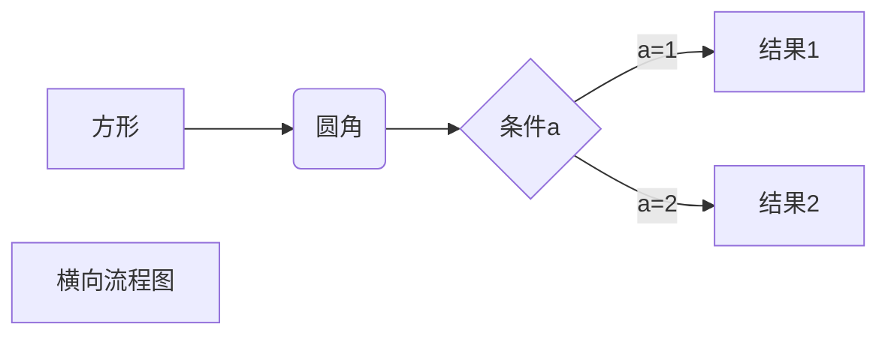
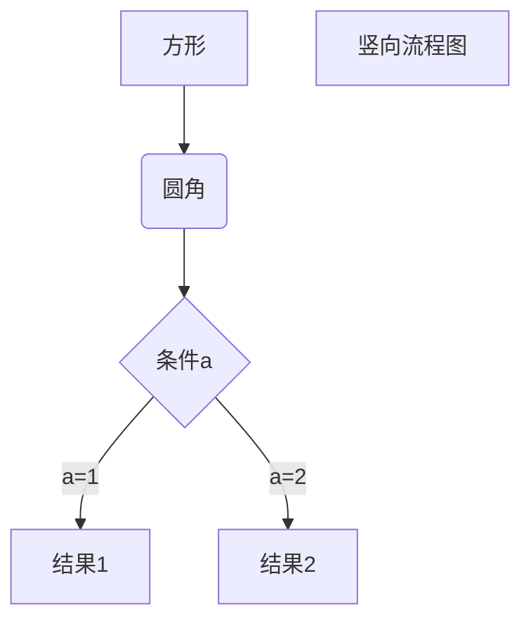

# 1d_dirichlet

Graph TD

Start --> stop

```flow
st=>start: 开始框
op=>operation: 处理框
cond=>condition: 判断框(是或否?)
sub1=>subroutine: 子流程
io=>inputoutput: 输入输出框
e=>end: 结束框
st->op->cond
cond(yes)->io->e
cond(no)->sub1(right)->op
```







## 1d_dirichlet.i

```C++
[Mesh]
	type = GeneratedMesh
  dim = 1
  nx = 10
  xmax = 2
[]

[Variables]
	[v]
    initial_condition = 1.1
  []
[]

[Kernels]
  inactive = 'ad_diff'
  [diff]
    tyep = MatDiffusion
    variable = v
    diffusivity = 'coef'
  []
	[ad_diff]
    type = ADMatDiffusion
    variable = v
    diffusivity = 'ad_coef_2'
  []
  [sink]
    type = ADBodyForce
    variable = v
    function = 'sink'
  []
[]

[BCs]
	[bounds]
		type = DirichletBC
		variable = v
		boundary = 'left right'
		value = 0
	[]
[]

[Functions]
	[sink]
		type = ParaseFunction
		value = '3*x^3'
	[]
[]

[Materials]
	[ad_coef]
		type = ADParsedMaterial
		f_name = 'ad_coef'
		function = '0.01*max(v,1)'
		args = 'v'
	[]
	[converter_to_regular]
		type = MaterialADConverter
		ad_props_in = 'ad_coef'
		reg_props_out = 'coef'
	[]
# at this poin we should have lost the derivatives
	[converter_to_ad]
		type = MaterialADConverter
		reg_prop_in = 'coef'
		ad_props_out = 'ad_coef_2'
	[]
[]

[Executioner]
	type = Steady
	solve_type = 'NEWTON'
[]

[Outputs]
	exodus = true
[]
```


$$
0.01*max(v, 1)\triangledown^2v=3x^3\\BC: v|_{x=0,x=2}=0
$$
[MaterialADConverter](https://mooseframework.inl.gov/source/materials/MaterialADConverter.html)实现`regular material`和`AD material`属性的转变。


## ad_global_index_mapping.i

```C++
[Mesh]
	type = GeneratedMesh
  dim = 2
  nx = 2
  ny = 2
  second_order = true
[]

[Variables]
	[u]
		initial_condition = 1
	[]
	[v]
		initial_condition = 1
		order = SECOND
	[]
[]

[Kernels]
	[u_diff]
		type = ADMaterialDiffusion
		variable = u
		diffusivity = diffusivity
	[]
	[v_diff]
		type = ADMatDiffusion
		variable = v
		diffusivity = diffusivity
	[]
[]

[BCs]
	[left_u]
		type = DirichletBC
		variable = u
		boundary = left
		value = 0
	[]
	[right_u]
		type = DirichletBC
		variable = u
		boundary = right
		value = 1
	[]
	[left_v]
		type = DirichletBC
		variable = v
		boundary = left
		value = 1
	[]
	[right_v]
		type = DiricheltBC
		variable = v
		boundary = right
		value = 0
	[]
[]

[Materials]
	[ad_coupled_mat]
		type = ADCheckGlobalToDerivativeMap
		u = u
		v = v
		mat_prop = diffusivity #这个material定义的ADmaterial
	[]
[]

[Executioner]
	type = Steady
	solve_type = 'Newton'
	petsc_options_iname = '-pc_type -pc_hypre_type'
	petsc_options_value = 'hypre boomeramg'
[]

[Outputs]
	exodus = true
[]
```

其中的[ADCheckGlobalToDerivativeMap](暂无)目的是确认**globalDofIndexToDerivative**产生正确的用于计算**Jacobians**。

根据**ADCheckGlobalToDerivativeMap::computeQpProperties()**来看，计算结果是
$$
mat\_{prop} = 1.0 + u^2*v^3
$$
方程是
$$
(1.0+u^2*v^3)*\triangledown^2u=0\\(1.0+u^2*v^3)*\triangledown^2v=0\\
BC:u|_{left}=0 \quad u|_{right}=1\\v|_{left}=1\quad v|_{right} = 0
$$


## ad_material.i

```C++
[Mesh]
	type = GeneratedMesh
	dim = 2
	nx = 4
	ny = 4
[]

[Variables]
	[u]
		initial_condition = 1
	[]
[]

[Kernels]
	[diff]
		type = ADMatDiffusionTest
		variable = u
    #what name of property to use, the prefix indicates the getter type in the kernel; the suffix indicates the declaration type in the material. AdAd RegReg
		prop_to_use = 'AdAd'
    #the name of the AD material property we are going to use
		ad_mat_prop = ad_diffusivity 
		#the name of the AD material property we are going to use
    regular_mat_prop = regular_diffusivity
	[]
[]

[BCs]
	[left]
		type = DiricheltBC
		variable = u
		preset = false
		boundary = left
		value = 0
	[]
	[right]
		type = DirichletBC
		variable = u
    # whether or not to preset the BC(apply the value before the solve begins)
		preset = false
		boundary = right
		value = 1
	[]
[]

[Materials]
	[ad_coupled_mat]
		type = ADCoupledMaterial
		coupled_var = u
    # name of the ad property this material defines
		ad_mat_prop = ad_diffusivity
    # name of the regular property this material defines
		regular_mat_prop = regualr_diffusivity
	[]
[]

[Executioner]
	type = Steady
	
	solve_type = 'Newton'
	
	petsc_options_iname = '-pc_type -pc_hypre_type'
	petsc_options_value = 'hypre bommeramg'
	
	l_tol = 1e-10
	nl_rel_tol = 1e-9
[]

[Outputs]
	exodus = true
[]
		
```

**ADMatDiffusionTest**是用于判断哪种material使用，如果是**AdAd**则采用ad_mat_prop，如果是RegReg则采用regular_mat_prop。

**ADCoupledMaterial**是定义**ad_mat_prop=4.0*coupled_var**。
$$
4*u\triangledown^2u=0
$$


## ad_stateful_material

```C++
[Mesh]
	type = GeneratedMesh
	dim = 2
	nx = 10
	ny = 2
[]

[Variables]
	[u]
		initial_condition = 1
	[]
[]

[Kernels]
	[diff]
		type = ADMatDiffusionTest
		variable = u
		prop_to_use = 'AdAd'
		ad_mat_prop = 'diffusivity'
		regular_mat_prop = 'unused_diffusivity'
	[]
[]

[Kernels]
	[force]
		type = BodyForce
		variable = u
		value = 1
	[]
[]

[BCs]
	[left]
		type = DirichletBC
		variable = u
		boundary = left
		value = 0
	[]
	[right]
		type = DirichletBC
		variable = u
		boundary = right
		value = 1
	[]
[]

[Materials]
  [const_material]
  	type = GenericConstantMaterial
  	prop_names = 'unused_diffusivity'
  	prop_values = '0'
  []
  [ad_stateful]
  	type = ADStatefulMaterial
  	u = u
  []
[]
    
[Executioner]
	type = Transient
	num_steps = 5
	line_search = 'none'
	
	solve_type = 'Newton'
	
	petsc_options_iname = '-pc_type -pc_hypre_type'
	petsc_options_value = 'hypre boomeramg'
	
	l_tol = 1e-10
	nl_rel_tol = 1e-9
[]

[Outputs]
	[exodus]
		type = Exodus
		show_material_properties = 'diffusivity'
	[]
[]
	
```

**ADStatefulMaterial**是**diffusivity = diffusivity_old2.0u**。**diffusivity_old**默认是0.5
$$
u*\triangledown^2=1\\
BC: u|_{x=0}=0 \quad u|_{x=1}=1
$$


## piecewise_linear_interpolation_material.i

```C++
[Mesh]
	type = GeneratedMesh
	dim = 2
	nx = 3
	ny = 3
	nz = 0
	elem_type = QUAD4
[]

[Variables]
	[u]
		order = FIRST
		family = LAGRANGE
	[]
[]

[Kernels]
	[diff1]
		type = ADDiffusion
		variable = u
	[]
[]

[BCs]
	[left_u]
		type = DirichletBC
		variable = u
		boundary = left
		value = 0
	[]
	[right_u]
		type = DiricheltBC
		variable = u
		boundary = right
		value = 1
	[]
[]

[Materials]
	[m1]
		type = ADPiecewiseLinearInterpolationMaterial
		property = m1
		variable = u
		xy_date = '0 0
							 1 1'
		block = 0
		outputs = all
	[]
	[m2]
		type = ADPiecewiseLinearInterpolationMaterial
		property = m2
		variable = u
		x = '0 1'
		y = '0 1'
		block = 0
		outputs = all
	[]
[]

[Executioner]
	type = Steady
	solve_type = 'PJFNK'
[]

[Outputs]
	exodus = true
[]
```

**ADPiecewiseLinearInterpolationMaterial**使用依赖于变量的线性插值函数来计算材料属性。材料计算使用*f(x)*计算，其中x是和位置相关的变量值。其实就是xy线性插值函数，u是自变量。比如代码中*f(x)=x,x[0,1],variable=u*，就是*f(u)=u,u[0,1]*


# boundary_material

## bnd_coupling_vol.i

```C++
[Mesh]
	type = GeneratedMesh
	dim = 2
	xmin = 0
	xmax = 1
	ymin = 0
	ymax = 1
	nx = 4
	ny = 4
	elem_type = QUAD9
[]

[Functions]
	[ecact_fn]
		type = ParsedFunction
		value = x*x+y*y
	[]
	
	[f_fn]
		type = ParsedFunction
		value = -4*3+x*x+y*y
	[]
[]

[Variables]
	[u]
		family = LAGRANGE
		order = SECOND
	[]
[]

[Kernels]
	[diff]
		type = DiffusionKernel
		variable = u
		offset = 0
		mat_prop = k3vol
	[]
	[r]
		type = Reaction
		variable = u
	[]
	[ffn]
		type = BodyForce
		variable = u
    function = f_fn
   []
[]

[BCs]
	[all]
		type = MatDivergenceBC
		variable = u
		prop_name = k3bnd
		boundary = 'left right top bottom'
	[]
[]

[Materials]
	[k1vol]
		type = GenericConstantMaterial
		prop_names = 'k1vol'
		prop_values = 1
		block = 0
	[]
	[k2vol]
		type = GenericConstantMaterial
		prop_names = 'k2vol'
		prop_values = 2
		block = 0
	[]
	[k2bnd]
		type = GenericConstantMaterial
		prop_names = 'k2bnd'
		prop_values = 2
		boundary = 'left right top bottom'
	[]
	[k3vol]
		type = SumMaterial
		sum_prop_name = k3vol
		mp1 = k1vol
		mp2 = k2vol
		block = 0
		
		val1 = 1
		val2 = 2
	[]
	
	[k3bnd]
		type = SumMaterial
		sum_prop_name = 'k3bnd'
		mp1 = k1vol
		mp2 = k2bnd
		boundary = 'left right top bottom'
		
		val1 = 1
		val2 = 2
	[]
[]

[Postprocessors]
	[12err]
		type = ElementL2Error
		variable = u
		function = exact_fn
	[]
[]

[Executioner]
	type = Steady
	solve_type = NEWTON
	
	petsc_options_iname = '-pc_type'
	petsc_options_value = 'lu'
[]

[Outputs]
	execute_on = 'timestep_end'
	exodus = true
[]
```

$$
k\triangledown^2u+u-f=0\\f=-4*3+x^2+y^2
$$

其中$u=x^2+y^2$，k=3，其中设置`k3vol = k1vol+k2vol`，其中`k1vol=1 k2vol = 2`，边界上的`k3bnd = k1vol+k2bnd`

**DiffMkernel**中

```C++
params.addParam<Real>("offset", 4.0, "Offset on residual evaluation");
DiffMKernel::computeQpResidual()
{
  return _diff[_qp] * _grad_test[_i][_qp] * _grad_u[_qp] - _offset;
}
```

**MatDivergenceBC**中

```C++
virtual MatDivergenceBC::~MatDivergenceBC() {}//一般都是默认的析构函数
Real
MatDivergenceBC::computeQpResidual()
{
  return _mat[_qp] * DivergenceBC::computeQpResidual();
}
```

`DivergenceBC`其实就是`IntegragedBC`（不知道我为什么要弄两个名字），是给通量边界赋值。

**SumMaterial**中

```C++
void
SumMaterial::computeQpProperties()
{
  if (_mp1[_qp] != _val_mp1)
    mooseError("failure");
  if (_mp2[_qp] != _val_mp2)
    mooseError("failure");
  _sum[_qp] = _mp1[_qp] + _mp2[_qp];
}
```

**ElementL2Error**是计算`variable`和`function`之间的误差。

## elme_aux_bc_on_bnd.i

```C++
[Mesh]
	type = GeneratedMesh
	dim = 2
	
	xmin = 0
	xmax = 1
	nx = 3
	
	ymin = 0
	ymax = 1
	ny = 3
[]

[AuxVariables]
	[foo]
		order = CONSTANT
		family = MONOMIAL
	[]
[]

[Variables]
	[temp]
		initial_condition = 1
	[]
[]

[AuxKernels]
	[copy_bar]
		type = MaterialRealAux
		property = bar
		variable = foo
		boundary = right
		execute_on = timestep_end
	[]
[]

[Kernels]
	[heat]
		type = CoefDiffusion
		variable = temp
		coef = 1
	[]
[]

[BCs]
	[leftt]
		type = DirichletBC
		boundary = left
		value = 2
		variable = temp
	[]
[]

[Materials]
	[thermal_cond]
		type = GenericConstantMaterial
		prop_name = 'bar'
		prop_value = '1'
		block = 0
	[]
[]

[Executioner]
	type = Transient
	solve_type = 'PJFNK'
	num_steps = 1
	end_time = 1
[]

[Outputs]
	exodus = true
[]
```

**CoefDiffusion**中

```C++
Real
CoefDiffusion::computeQpResidual()
{
  return _coef * _grad_test[_i][_qp] * _grad_u[_qp];
}
```

**MaterialRealAux**将$property = bar$，赋值给<u>辅助变量</u>$foo$。


## fv_material_quadrature.i

```C++
[Mesh]
	type = GeneratedMesh
	dim = 2
	xmin = 0
	xmax = 1
	ymin = 0
	ymax = 1
	nx = 4
	ny = 4
	elem_type = QUAD9
[]

[Functions]
	[linear_x]
		type = ADParsedFunction
		value = 'x'
	[]
	[piecewise_linear_x]
		type = ADPiecewiseLinear
		x = '-1 2'
		y = '-1 2'
		axis = 'x'
	[]
[]

[Variables]
	[u]
		family = MONOMIAL
		order = CONSTANT
		fv = true
	[]
[]

[FVKernels]
	[diff]
		type = FVDiffusion
		variable = u
		coeff = k1
		coeff_interp_method = average
	[]
	[r]
		type = FVReaction
		variable = u
	[]
[]

[FVBCs]
	[all]
		type = FVDirichletBC
		variable = u
		boundary = 'left right bottom top'
		value = 1
	[]
[]

[Materials]
	active = 'k1'
	[k1]
		type = ADGenericFunctorMaterial
		prop_names = 'k1'
		prop_values = linear_x
		block = 0
	[]
	[k1_piecewise]
		type = ADGenericFunctorMaterial
		prop_names = 'k1'
		prop_values = piecewise_linear_x
		block = 0
	[]
[]

[Executioner]
	type = Steady
	solve_type = NEWTON

	petsc_options_iname = '-pc_type'
	petsc_options_value = 'lu'
[]

[Outputs]
	execute_on = 'timestep_end'
	exodus = true
[]
```

**FVDiffusion**是采用有限体积（**FVB**）计算方法。
$$
-\triangledown \cdot D\triangledown u = 0 \in \Omega
$$
采用散度定理
$$
\int_{element} - \triangledown \cdot D \triangledown u = \sum_{elemenfacesf} -D_f \triangledown u_f \cdot \vec{n}_{f}area_f
$$
其中$D_f$有两种形式，一种是**Simple arithmetic average**， $D_f = w_1D_1+(1-w_1)D_2$，另一种是**Simple harmonic average**，$D_f = \frac{1}{\frac{w_1}{D_1}+\frac{1-w_1}{D_2}}$。相关设置在**coeff_interp_method**。

**ADPiecewiseLinear**等于PiecewiseLinear，是线性插值x和y之间的数据。设置**axis**可以修改x变量的默认（时间t），改为x，y，z。


# Coupled_value_function

## adjac.i

```C++
[Mesh]
	[gen]
		type = GeneratedMeshGenerator
		dim = 2
		nx = 5
		ny = 5
	[]
[]

[Variables]
	[u]
		initial_condition = 0.1
	[]
	[v]
		initial_condition = 0.1
	[]
[]

[Materials]
	[Du]
		type = ADCoupledValueFunctionMaterial
		function = x
		v = v
		prop_name = Du
	[]
	[Dv]
		type = ADCoupledValueFunctionMaterial
		function = x^2
		v = u
		prop_name = Dv
	[]
[]

[Kernels]
	[diff_u]
		type = ADMatDiffusion
		diffusivity = Du
		variable = u
	[]
	[dudt]
		type = ADTimeDerivative
		variable = u
	[]
	[diff_v]
		type = ADMatDiffusion
		diffusivity = Dv
		variable = v
	[]
	[dvdt]
		type = ADTimeDerivative
		variable = v
	[]
	
[BCs]
	[u_left]
		type = DirichletBC
		boundary = left
		variable = u
		value = 1
	[]
	[u_right]
		type = DirichletBC
		boundary = right
		variable = u
		value = 0.1
	[]
	[v_top]
		type = DirichletBC
		boundary = top
		variable = v
		value = 1
	[]
	[v_bottom]
		type = DirichletBC
		boundary = bottom
		variable = v
		value = 0.1
	[]
[]

[Executioner]
	type = Transient
	solve_type = NEWTON
	dt = 0.1
	num_steps = 4
[]

[Outputs]
	exodus = true
[]
```

**ADCoupledValueFunctionMaterial**是将变量$v$等于<u>function</u>中的自变量。

```C++
template <bool is_ad>
void CoupledValueFunctionMaterialTempl<is_ad>::computeQpProperties()
{
  MooseADWrapper<Point, is_ad> p;
  GenericReal<is_ad> t = 0.0;
  
  for (const auto i : make_ranger(_nvals))
  {
    const auto & j = _order[i];
    if (j < 3)
      p(j) = (*_vals[i])[_qp];
    else
      t = (*_vals[i])[_qp];
  }
  
  _prop[_qp] = _function.value(t, p);
}
```

## order.i

```C++
[Mesh]
	[gen]
		type = GeneratedMeshGenerator
		dim = 3 
		nx = 4
		ny = 4
		nz = 4
	[]
[]

[Functions]
	[test]
		type = ParseFunction
		value = 't + x^2 + y^3 + sin(5*z)'
	[]
[]

[AuxVariables]
	[a]
	[]
	[b]
	[]
	[c]
	[]
	[d]
	[]
[]

[ICs]
	[a]
		type = FunctionIC
		variable = a
		function = x
	[]
	[b]
		type = FunctionIC
		variable = b
		function = y
	[]
	[c]
		type = FunctionIC
		variable = c
		function = z
	[]
	[d]
		type = FunctionIC
		variable = d
		function = t
	[]
[]

[Variables]
	[u]
	[]
[]

[Materials]
	[cvf]
		type = CoupledValueFunctionMaterial
		function = test
		v = 'a b c d'
		prop_name = p
		outputs = exodus
	[]
[]

[Problem]
	kernel_coverage_check = false
	solve = false
[]

[Executioner]
	type = Transient
	dt = 0.25
	num_steps = 4
[]

[Outputs]
	exodus = true
[]
```


就是用abcd的输入作为p这个材料属性的变量。

# declare_overlap

## error.i

```C++
[Mesh]
	[gen]
		type = GeneratedMeshGenerator
		dim = 2
		nx = 10
		ny = 1
	[]
	[left_domain]
		input = gen
		type = SubdomainBoundingBoxGenerator
		bottom_left = '0 0 0'
		top_right = '0.5 1 0'
		block_id = 10
	[]
[]

[Variables]
	[u]
		initial_condition = 2
	[]
[]

[Kernels]
	[diff]
		type = MatDiffusionTest
		variable = u
		prop_name = 'p'
	[]
[]

[BCs]
	[left]
		type = DirichletBC
		variable = u
		boundary = left
		value = 2
	[]
	[right]
		type = DirichletBC
		variable = u
		boundary = right
		value = 3
	[]
[]

[Materials]
	[all]
		type = GenericConstantMaterial
		prop_names 'f f_prime p'
		prop_values = '2 2.5  2.468'
		block = ANY_BLOCL_ID
		outputs = all
	[]
	
	[left]
		type = GenericConstantMaterial
		prop_names = 'f f_prime p'
		prop_values = '1 0.5    1.2345'
		block = 10
		outputs = all
	[]
[]

[Executioner]
	type = Steady
	solve_type = PJFNK
	petsc_options_iname = '-pc_type -pc_hypre_type'
	petsc_opitons_value = 'hypre boomerame'
[]

[Outputs]
	print_linear_residuals = true
	perf_graph = true
[]
```

**SubdomainBoundingBoxGenerator**

制定框内或者框外的subdomian **ID**。

**ANY_BLOCK_ID**是全局定义的一个变量，应该是所有的id-1。

测试发现此输入卡并不能运行，错误

```
*** ERROR ***
The following error occurred in the object "MOOSE Problem", of type "FEProblem".

The following material properties are declared on block 10 by multiple materials:
  Material Property             Material Objects
  f                             all left
  f_prime                       all left
  p                             all left
```

# derivative_material_interface

## ad_bad_evaluation.i

```C++
[Mesh]
	type = GeneratedMesh
	dim = 1
[]

[Variables]
	[u]
	[]
[]

[Kernels]
	[diff]
		type = ADMatDiffusion
		variable = u
		diffusivity = F
	[]
[]

[Materials]
	[time_no_ad]
		type = GenericFunctionMaterial
		prop_names = 'time_no_ad'
		prop_values = 't'
		outputs = all
	[]
	[time]
		type = MaterialADConverter
		reg_props_in = time_no_ad
		ad_props_out = time
	[]
	
	[F]
		type = ADDerivativeParsedMaterial
		f_name = F
		material_property_names = 'time'
		function = 'if (time < 1.9, 1, log(-1))'
    # diable the function parser algebraic optimizer
		disable_fpoptimizer = true
    # what to do if evalutaion error occurs
		evalerror_behavior = nan 
	[]
[]

[Executioner]
	type = Transient
	num_steps = 2
[]
```

**ADDerivativeParsedMaterial**

是Parsed funtion的派生，继承了原来的**ParseMaterial**加上自动求导功能。

<u>material_property_names</u>参数

|         表达式         |                             解释                             |
| :--------------------: | :----------------------------------------------------------: |
|           F            |               定义材料属性*F*，没有和变量相关                |
|       F(c, phi)        | 材料属性*F*和变量'c'和'phi'相关，通过**DerivativeFunctionMaterial**实现 |
| d3x:=D[x(a, b),a, a,b] | 三阶导数$$\frac{\partial^3x}{\partial^2a\partial b}$$，x是依赖ab的材料属性，整个表达式赋值给d3x |
|       dF:=D[F,c]       |                求F关于c的导数，认为F是c的函数                |

## ad_const.i

```C++
[Mesh]
	type = GeneratedMesh
	dim = 2
	nx = 1
	ny = 1
[]

[AuxVariables]
	[dummy]
	[]
[]

[Materials]
	[provider]
		type = ADDerivativeMaterialInterfaceTestProvider
		blok = 0
	[]
	[client]
		type = ADDerivativeMaterialInterfaceTestClient
		prop_name = prop
		block = 0
		outputs = exodus 
	[]
	[client2]
		type = ADDerivativeMaterialInterfaceTestClient
		prop_name = 1.0
		block = 0
		outputs = exodus
	[]
	
	[dummy]
		type = ADGenericConstantMaterial
		prop_names = prop
		block = 0
		prop_values = 0
	[]
[]

[Executioner]
	type = Steady
[]

[Problem]
	type = false
[]

[Outputs]
	exodus = true
[]
```

# 
