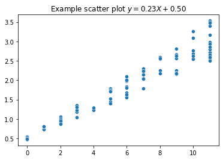
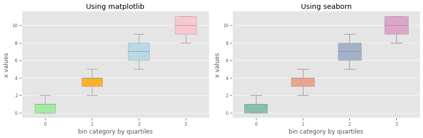

This entry assumes that you’re already familiar with `python`, `matplotlib` and `seaborn` and are looking to be more productive when using these tools for your research work. If you’re looking for introductory coding material, there are a few links at the end of the article to get you started. All the same, this entry should still be able to frame things and you can go into the specific coding tutorials. 

The idea here is to set up a reusable theme/style and find suitable settings for publication-quality plots. That way, you have consistent styling in your plots and, of course, by scripting your process, it is easier to update your report as your experiments or your output media change. 

## Summary 

- There are different ways to create plots using matplotlib, seaborn and even pandas. However, they all share a common figure and axes interface and can, therefore, be styled consistently using the same style sheet. 

- A style sheet is a matplotlib's rcParams config file, which only includes plot-styling parameters. A style sheet is loaded by `matplotlib.pyplot.style.use` and multiple style sheets can be combined/cascaded by providing them as a list. The order of listing matters; the first style in the list has the lowest priority and the last one has the highest priority. 

- You may use predefined style sheets from seaborn or matplotlib. You may also chain/cascade them with your custom styles, which need only to include those elements you want to customize. For instance, different publications (or report types, e.g. executive summary vs full report) may have specific styling directives and, thus, you may have modular style sheets for specific requirements and cascade them with a core/default style sheet for general properties. 

- Styles can be applied globally, which affects all plots after the style sheet has been set, or using context managers for temporary changes. Additionally, `sns.set_context` avails styles for auto-scaling your graphics to different media like notebook, talk (presentations), paper or posters. That works by applying a scaling factor to size-related elements like font sizes, line widths or label sizes. Consequently, you only need to load your style and then set_context to adjust to the current medium. 

## The context 

Matplotlib is a massive and powerful library and there's loads you can do to customize your plots. Seaborn builds on matplotlib, providing easier-to-use functions and additional design-related implementations for nice-looking plots; it is a higher-level plotting library. Below is an overview of how a figure is structured in matplotlib. You have the figure, which is the general chart area, and the axes, which contains the plot and its components. You can style the *figure* or the *axes* directly in code or through a configuration file (pretty much a style sheet). Seaborn can take as input a matplotlib axes object and usually returns an axes object. Therefore, whether using matplotlib or seaborn, you can plan out your themes/styles similarly. 

   Main components of a plot on matplotlib. Source: <a href="https://realpython.com/python-matplotlib-guide/" target="_blank">Real Python</a> 

The `figure` object is the top-level container for all plot elements (the underlying canvas), while the axes object is specific to a given plot. For instance, therefore, you can contain multiple axes objects (e.g. two line graphs) in the same figure. The figure object determines traits such as figure size, background color, spacing between plots, general line and font colors, and characteristics of figures when saved to file. The `axes` object contains the elements of an individual plot and, therefore, directs the characteristics of individual plot components such as title, axis labels, tick marks and legends, as well as color and line/edge properties. Aside from the object oriented interfaces, matplotlib also avails procedural interfaces, which automatically instantiate the relevant figure and axes objects and avail convenient methods for common types of charts. For instance, any time you use `plt.plot`. At any point, you can also access the current figure and axes object by calling `plt.gcf()` and `plt.gca()` respectively. Additionally, the wrapper or convenience methods will often fetch the current figure or axes first and delegate accordingly. Bottom line, you want the figure or axes object for any manipulation or styling and you can do it all consistently from one place irrespective of how you eventually create your plots (PS: If you're familiar with `pandas`, it provides similar plotting interfaces as `plt.plot`). 

## Customizing plot style
There are four main ways to style your plots. In order of prioritization, from highest to lowest (higher priority settings will override lower priority definitions), the approaches are

1. `Axes` elements and their lower level rendering objects. 
2. Runtime style update via `rcParams`, which is a dictionary-like variable containing global settings. 
3. Using a style sheet, which is an rcParams configuration file that is limited to plot properties only.
4. Using `matplitlibrc` file, an rcParams configuration file that includes all kinds of properties.

 
<a href="https://matplotlib.org/stable/api/axes_api.html#the-axes-class" target="_blank">**1. Axes:**</a> Axes object has setter and related functions for the different elements that make up a plot. For instance, `Axes.set_title`, `Axes.set_yticks`, `Axes.set_frame_on`, etc. It also has a lower level object called `Artist`, which knows how to draw on the figure canvas. There are several tutorials out there on how to manipulate the axes object so I'll just present the gist of it and what I've learnt so far then leave you to it. As you can imagine, the easiest way to set the style of axes elements is through the setter methods and additional axes helper functions. Most often, manipulating the axes object will suffice. 

Axes setter properties are also stored in rcParams. Therefore, instead of having it in code, you can move your styling definitions to a configuration or style document and simply import the file for use in different works. So far, I've seen that styling through the Axes object seems most suited for dynamically created elements with styles that are highly dependent on some properties of the data, or for more advanced cases where you have to create some custom Artist objects. 

<a href="https://matplotlib.org/stable/api/matplotlib_configuration_api.html#matplotlib.rcParams" target="_blank">**2. Runtime rcParams:** </a> `rcParams` is a matplotlib dictionary-like variable that holds package-wide or global variable settings. Therefore, you can modify it directly by updating the values of individual keys or updating it with another dictionary. There's also a convenience method, `matplotlib.rc`, which can update multiple settings of the same element.  


## Runtime rcParams updates 
import matplotlib as mpl

## i. directly updating an individual setting in rcParams
mpl.rcParams['lines.linestyle'] = '--' 
mpl.rcParams['lines.linewidth'] = 2.8
mpl.rcParams['lines.color'] = 'red' 

## ii. convenience function for updating rcParams  
mpl.rc('lines', linestyle='--', linewidth=2.8, color='red') 

## iii. updating from another dict 
line_props = dict(ls='--', lw=2.8, c='r')    ## using aliases e.g. lw=linewidth
mpl.rc( 'lines', **line_props)
## OR
line_props = {'lines.linestyle':'--', 'lines.linewidth':2.8, 'lines.color':'red'}
mpl.rcParams.update( line_props )            ## cannot use aliases 



Runtime rcParams updates can also be constrained to some context. In the above cases, the changes are global and affect all plots made afterward. The default settings can be restored by `matplotlib.rcdefaults()`. A context manager is available for when you want to temporarily change the default or global style.


## this will only apply the line_props to plots made within the context manager
with mpl.rc_context( line_props):
    plt.plot( x, y ) 


<a href="https://matplotlib.org/stable/api/style_api.html#matplotlib.style.use" target="_blank">**3. Style Sheets:**</a> A style is an rcParams configuration file that only includes plot-related settings. Remember, rcParams is a package-wide configuration variable and includes all sorts of settings. A style sheet is imported using `matplotlib.style.use` and any non-plot related settings in it will be ignored. There are several predefined styles provided by matplotlib and seaborn, which can be applied globally or using a context manager. You can also define your own styles (we'll see how to do that in a bit) and import them in the same way. Furthermore, you can chain/cascade multiple style sheets. Prioritization of the updates, in that case, would be in reverse - The first style sheet listed has the lowest priority and the last one has the highest priority. Think of a cascade of dictionary update calls, the last call will update any prior updates. Additionally, you can add your style sheet to matplotlib's config directory (check location using `matplotlib.get_configdir` and the default location is usually `~/.config/matplotlib`, where `~` is your home/user directory) and name it as `<some-name>.mplsyle`. Afterwards use it by calling `plt.style.use('<some-name>')`. 


## i. list all available styles 
print( plt.style.available )

## ii. use a style - global setting 
plt.style.use( 'ggplot' )                    ## predefined in matplotlib 
plt.style.use( '../res/mypaper_style.txt')   ## custom  

## iii. use a style - context constrained
with plt.style.context('ggplot'):
    plt.plot(x,y)

## iv. use multiple styles - simply pass them as a list 
plt.style.use(['ggplot','white','mystyle'] ) 

## v. use sns context for differentiated sizing/scaling on different media
sns.set_context('notebook') 



Seaborn also provides styles that are meant to scale your graphics/plots for different presentation/reporting media. <a href="https://seaborn.pydata.org/generated/seaborn.set_context.html" target="_blank">`seaborn.set_context`</a> is an abstraction that works through matplotlib's rcParams. Scaling affects only size-related elements such as font sizes, line sizes (width) and label sizes. There are four contexts - notebook, paper, talk and poster. Therefore, you don't need to change your style sheet for different media if your primary concern is legibility due to scaling. 

<a href="https://matplotlib.org/stable/tutorials/introductory/customizing.html#the-matplotlibrc-file" target="_blank">**4. Matplotlibrc file:**</a> This is the rcParams configuration file, which contains all sorts of properties. It is loaded at startup and there are set locations where matplotlib will look for it. Changing this file can change the default properties of matplotlib for a given installation/environment depending on where the file is saved. That also means that anytime matplotlib is installed the config file will be overwritten if it is stored in the installation folder. For customizations that are specific to some use, save the configuration file in the current working directory. To avoid overwriting an updated installation config file, save it in your user profile, which depends on your platform e.g. `.config/matplotlib/matplotlibrc`. <a href="https://matplotlib.org/stable/users/faq/troubleshooting_faq.html#locating-matplotlib-config-dir" target="_blank">See documentation for specifics</a>. Generally, the order of the search is from the most custom setup (in the current working directory) to the most generic/system-wide (installation folder) and once a `matplotlibrc` file is found, the search stops (only one file can be active). 

I think the sweet spot is working with the style sheets - you can reuse components and abstract some of your styling code from your scripts, you can chain/cascade/compose styles by mixing them, you can have your own global defaults (provided as a .mplstyle file), and you can use context managers to constrain usage. You can have one large style sheet, or make it modular (for composing/cascading). 

## Example style sheet
Alright, let's create a style sheet. When starting off, you'll often want to use a predefined style sheet from Matplotlib and Seaborn as your core style and then pair it with whatever customizations you'll need, by composing/cascading styles. Generally, any `Axes` element that can be styled in code using setters can be styled using rcParams and, therefore, you may have it in your style sheet. The full list of available rcParams can be viewed <a href="https://matplotlib.org/stable/api/matplotlib_configuration_api.html?highlight=rcparams#matplotlib.RcParams" target="_blank">here; matplotlib's documenetation</a>. 

You may also go to the matplotlib installation folder and copy a style sheet file (files with extension `.mplstyle`), and then make edits as desired or only borrow those properties that you'd like customized.  As rcParams is a dictionary-like variable, the entries in the style sheet are also key-value pairs per like in the general form `<key-name>: <value>`. The style sheet can be saved with say '.txt' file extension or '.mplstyle' (or whatever you like really, just be consistent and clear of its intentions) in any location you prefer. Here's <a href="https://matplotlib.org/stable/gallery/style_sheets/style_sheets_reference.html" target="_blank">matplotlib's stylesheets reference</a>.


## Example style sheet entries
## 1. figure properties 
figure.figsize : 3.5, 2.625
figure.facecolor : white 
figure.dpi : 100 
figure.titlesize : 12

## 2. legend properties
legend.fontsize : 10
legend.frameon : False

## 3. fonts 
font.family : sans-serif
font.weight : bold 

## 4. Plot axes 
axes.grid : False
axes.fontcolor : white
axes.titlesize : 12
axes.spines.top : False

## lines
lines.linewidth : 1.3
lines.linestyle : '-' 


## Color 
Dealing with color and colormaps is a large topic and this entry is already rather long. Matplotlib and Seaborn provide predefined colormaps or color palettes and there are different <a href="https://seaborn.pydata.org/tutorial/color_palettes.html" target="_blank">principles for using color in plots</a>. The key thing to remember is that your choice of color should have sufficient contrast for your audience to distinguish between different elements. Aside from the matplotlib and seaborn palettes, you can also define your own and there are various tools out there for building colorblind-friendly palettes. Defining your color palette can be as simple as listing the color values in descending priority order in code and then using Seaborn to create and set it (see code snippet below). When using a style sheet, matplotlib's `cycler` interface is used to set the color palette. 


## i. set global color palette
sns.set_palette( "Set2" ) 

## ii. set color palette for a give plot during construction
sns.countplot(y, paletted="Set2") 

## iii.a. define your own color palette
my_colors = ["#FF0B04", "#4374B3"]

## iii.b. preview your color palette
sns.palplot( my_colors )

## iii.c. use it 
sns.set_palette( sns.color_palette(my_colors) )



## setting up color palette in style sheet using rcParams
axes.prop_cycle: cycler(
    'color' : ["#FF0B04", "#4374B3"]
)


## Tips 
Somethings I've learnt so far on publication-quality plots that you may include in your style sheets

- Probably start with figure sizes of 3 - 4 inches, for width and height per plot in a figure. For instance, for a figure with five plots in one row, the initial figure size in (h, w) could be $(4, 3*5)$, then adjust as desired. If the figure has only one plot try starting with 6 inches for the width if it is for a single-column document. Forums/journals will also indicate preferred figure sizes. 

- Prefer saving figures as '.pdf' (a vector format) over '.png' or other raster formats, as they scale better without loss of quality when fitting them in your document. Pdf files work great in latex.

- Remember to use `plt.tight_layout` unless you explicitly set the plot spacing. Do the same when saving figures (else any off-frame annotations will be truncated). In the style sheet, add `savefig.bbox : tight` 

- Consider colorblind friendly color palettes. Build one using any of the many tools out there (lots from web development). Checkout <a href="https://personal.sron.nl/~pault/" target="_blank"> Paul Tol's colorblind friendly palettes</a> and <a href="https://davidmathlogic.com/colorblind/#%23D81B60-%231E88E5-%23FFC107-%23004D40-%23a0c36a" target="_blank"> David's palette builder  </a>. You may also consider `patch.set_hatch`, which can add texture/shading, in addition to using colors with sufficient contrast.

- Font sizes and figure dpi will often depend on the target forum/journal. Some forums may also prescribe a color palette. 

- Usually, serif or sans-serif family of fonts e.g. Times, Arial, etc

- Set axis limits and remove unnecessary tick marks (about 3 - 4 tick marks tops per axis). 

- Use latex for math formating. 

- Check out <a href="https://github.com/garrettj403/SciencePlots" target="_blank"> Science plots on Github</a> for examples, ideas and base style sheets for publications and some specific academic journals. 

## References and Resources 

<ul>
<li><a href=”https://matplotlib.org/stable/tutorials/introductory/customizing.html”  target="_blank">Tutorial by Matplotlib on style sheets and rcParams</a></li>

<li><a href=”http://www.jesshamrick.com/2016/04/13/reproducible-plots/” target="_blank">Step by step tutorial on how to (re)produce publication quality plots using Matplotlib and Seaborn</a> and another one that <a href="https://towardsdatascience.com/making-publication-quality-figures-in-python-part-i-fig-and-axes-d86c3903ad9b" target="_blank">includes setting axis locators</a></li>

<li>If you’re just getting started, here are some starter tutorials I found rather informative and easy to work with - <a href=”https://realpython.com/python-matplotlib-guide/” target="_blank">Matplotlib guide</a> and <a href=”https://www.mygreatlearning.com/blog/seaborn-tutorial/” target="_blank">Seaborn tutorial </a> </li>

<li> <a href="https://seaborn.pydata.org/tutorial/color_palettes.html" target="_blank">Principles for using color in plots</a> by Seaborn, and <a href="https://www.codecademy.com/article/seaborn-design-ii" target="_blank"> a tutorial on color using Seaborn</a>. </li>

<li> Matplotlib's <a href="https://matplotlib.org/stable/tutorials/intermediate/color_cycle.html" target="_blank">cycler interface </a> for controling colors.</li> 

</ul>

## Appendix


## Example 1
import numpy as np 
import matplotlib.pyplot as plt
import seaborn as sns

## dummy data 
RNG = np.random.default_rng( 234) 
x = RNG.integers(low=0, high=12, size=100)
m = RNG.random()*2
c = RNG.random()*1
y = x*m + c 

## using matplotlib plot function 
plt.plot(x, y)
plt.title(f'Example line plot $y = {np.mean(m):.2f} X + {np.mean(c):.2f} $') 

## using seaborn and accessing the axes object from seaborn
## adding some noise to the dummy data for variability
m = RNG.random()*2 + RNG.random( len(x) )*.1  
c = RNG.random()*1 + RNG.random( len(x) )*.1
y = x*m + c 
## plotting with seaborn - same plot can be achieved with plt.scatter(x, y) 
ax = sns.scatterplot(x=x, y=y)
ax.set_title(f'Example scatter plot $y = {np.mean(m):.2f} X + {np.mean(c):.2f} $')



 Results from example 1 above 

[Note book with sample code]() that produces the following plots with and without style sheets. The code that makes use of style sheets is more appealing to navigate. 

