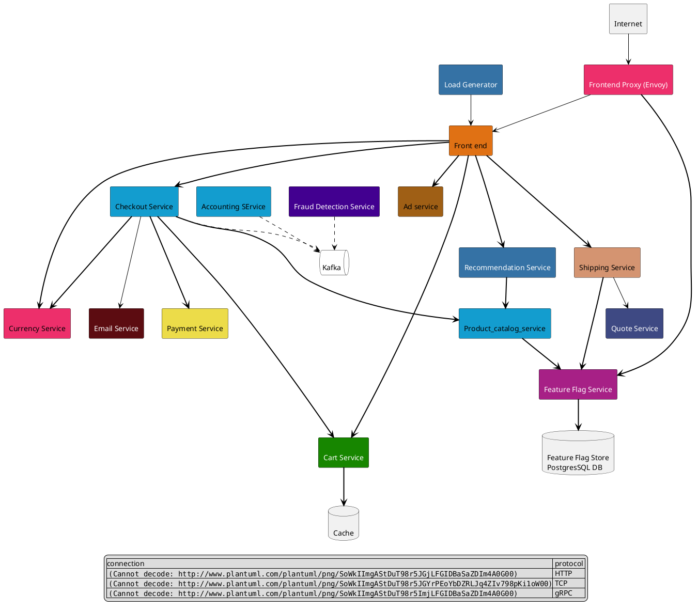
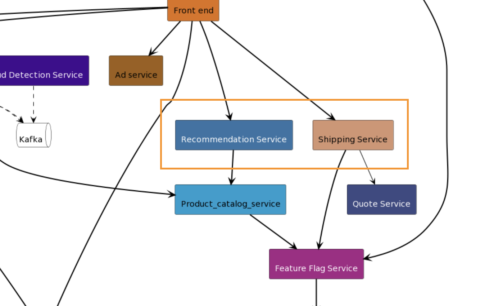

# blog plantuml otel architecture

* [categories: [blogging]](#categories:-[blogging])
* [intro](#intro)
  * [[What is Plantuml](https://en.wikipedia.org/wiki/PlantUML)](#[what-is-plantuml](https://en.wikipedia.org/wiki/plantuml))
  * [How to render](#how-to-render)
  * [why opentelemetry-demo](#why-opentelemetry-demo)
* [Build the diagram](#build-the-diagram)
  * [121 mapping with no layout change](#121-mapping-with-no-layout-change)

## intro

### [What is Plantuml](https://en.wikipedia.org/wiki/PlantUML)

There are other tools as plantuml:

- [mermaid](https://mermaid.js.org/#/)

### How to render

To render *plantuml* we need to select a server

* [spin up plantuml docker server](https://hub.docker.com/r/plantuml/plantuml-server)
* [use the online server](https://www.plantuml.com/plantuml/uml/SyfFKj2rKt3CoKnELR1Io4ZDoSa70000)

### why opentelemetry-demo

I read and follow **otel** and the repo is public available.

[The architecture](https://github.com/open-telemetry/opentelemetry-demo/blob/main/docs/current_architecture.md)
of the demo shows services that made up a **simple** online shop.
This is a perfect example to show the capability of plantuml and the simplicity on how a diagram can be build
by using *diagram as code*

## Build the diagram

### 121 mapping with no layout change

The first step is to create the same ammount of boxes we have for the orginal
diagram and colorin

<details>
<summary>Code snipped</summary>



</details>

![image](http://www.plantuml.com/plantuml/png/bLPTR-8w47tthx3AbNhlGoi-e9Js5hKDi5fj7zhbSNSL6MU0B2PE7QTjjDh_ldOWuAa3sY8XalauddDcFE8sqqpfV2q88GguPib203tv_v-5a3C8uqI3Ia0FloUVjuydb6MqihzBIWkzb8a9Vf0iefyW0SMqL6MACAPmKPbeezFhj-zwrnhUzDNhCjQ0eNIHGiPLdDgp9qecca8IbKXp-sPUQ6FSxBTQNPp8Kv5dzXkAE87mLQfepTJAebHvZqg-5VJVSV8YY_yGP9XQbm4UjISNzsvnvDIGvd8T9mkg5PlFOqxUPPrzQym4uwiVPyCT8AcKmbwKIB0qzJX4omNe9IZwYr3pGPn_iXTc2Dv5D0Fr4dCeIHdGxIjj32QzIQldPwwaDZALuh0yeYFGnXlBX4uTeBdrXL7bswDssytceEdAv1smaBOmpcMUQAlTTEmKk3Fl8LkTmIYO7C09bi1NCjUeEhurUXY_oQv3zARIz6Rew5Bhzm1jxmKhGD4E8Syvv1lbs7nbHVzYVyj2IWjjb49Ss-6xAY49EQJVUNNe-N2JJ6eKyOCymdx8qMbHUMOlrNGPfwav2OcPMIDgoAWxwFPR60NTzQ_0vNfjH6JUu2ZascFwTx--LpT3hw3wCE-aVUTc2jYAdE8b4KczsMe1K--cYIbtalgN5qqquCxvg00tp-kG6-i5-xtwgsqMv4f1mWjS_TPOWLURh6u8PeL16QzPB104MCi-lnSqWrRBLQ1s--nMzIChJ1kmfkd6vXGLZ8BkO0DQocBwVrIqeSVC3pzpzoPYuSUYrk7oS8kFLK3mVLYcXlvJBZKWyi_Muep-k3kuxBXw-clkKSaevphaJ3CXpUYxMYAVlpYFSHqUoYRUjNUrH0m8lcaVEcM_IBl4fBCPopQp256SbPUHBwjRQ9x2qcuOCLNF1aKX6K49ysmW9y1qhe1E1CEBRhvnX7F1717l-ktcvONR7KyQL44T2i7qFv28_nOuyOSIa8gfpFH2GVOiFDvQAZ1ZjGsOFZtGqNsD2ZQC46ohhzrB8hUcxdmj_W00)

> **together** statements allows to group objects without the need to have them within a bigger container

```bash

together {
        rectangle "<$rust>\nShipping Service" as shipping_service #D49471
        rectangle "<$python>\nRecommendation Service" as recommendation_service #3572A5;text:white
}

```



- change of line

> Line type are differentiate to connections
> this can be achieved with the use of different symbols

```bash
A --> B: Line
A ..> B: Dotted line
A ==> B: Bold line
```

[more explanation](https://crashedmind.github.io/PlantUMLHitchhikersGuide/layout/layout.html)

### User ortho lines

Ortho linetype render straight linnes instead of curved once

<details>
<summary>Code snipped</summary>

    ```plantuml

    @startuml
    skinparam linetype ortho
    rectangle "\nInternet" as internet

    rectangle "\nLoad Generator" as load_generator #3572A5;text:white
    rectangle "\nFront end" as frontend #E07114
    rectangle "\nFrontend Proxy (Envoy)" as frontend_proxy #ED2F6B;text:white

    ' incoming traffic
    frontend_proxy -[#black]-> frontend
    internet -[#black]-> frontend_proxy
    load_generator -[#black]-> frontend

    together {
        rectangle "\nAd service" as ad_service #9F5F15
        rectangle "\nFraud Detection Service" as fraud_detection_service #420090;text:white
        rectangle "\nAccounting SErvice" as accounting_service #139DCF
        rectangle "\nCheckout Service" as checkout_service #139DCF
    }

    frontend =[#black]=> ad_service
    frontend =[#black]=> checkout_service

    ' layer 3

    queue "\nKafka" as kafka #white;line:black

    fraud_detection_service .[#black].> kafka
    accounting_service .[#black].> kafka
    checkout_service .[#black].> kafka

    together {
        rectangle "\nShipping Service" as shipping_service #D49471
        rectangle "\nRecommendation Service" as recommendation_service #3572A5;text:white
    }

    frontend =[#black]==> shipping_service
    frontend =[#black]==> recommendation_service

    ' break
    '
    rectangle "\nCart Service" as cart_service #178600;text:white

    frontend ==[#black]==> cart_service
    checkout_service ==[#black]===> cart_service

    together {
        rectangle "\nCurrency Service" as currency_service #ED2F6B
        rectangle "\nEmail Service" as email_service #5C0C11;text:white
        rectangle "\nPayment Service" as payment_service #ECDC49;text:black
    }

    checkout_service ==[#black]=> currency_service
    checkout_service --[#black]-> email_service
    checkout_service =[#black]==> payment_service

    frontend ==[#black]=> currency_service

    rectangle "\nQuote Service" as quote_service #3E4983;text:white
    rectangle "\nProduct_catalog_service" as product_catalog_service #139DCF

    checkout_service =[#black]=> product_catalog_service
    shipping_service -[#black]-> quote_service
    recommendation_service =[#black]=> product_catalog_service

    ' layer 4
    database "\nCache" as cache_redis

    cart_service =[#black]=> cache_redis

    rectangle "\nFeature Flag Service" as feature_flag_service #A72086;text:white

    shipping_service =[#black]=> feature_flag_service
    product_catalog_service =[#black]=> feature_flag_service
    frontend_proxy =[#black]==> feature_flag_service

    database "\nFeature Flag Store\nPostgresSQL DB" as feature_flag_store

    feature_flag_service =[#black]=> feature_flag_store

    legend
        |connection | protocol |
        | | HTTP |
        | | TCP |
        | | gRPC |
    endlegend
    @enduml
    ```

</details>

![ortho](http://www.plantuml.com/plantuml/png/ZLPTR-8w47tthx3AbNhlGoi-e9Js5hKDS7MrVMYNnzrLP9m1iZXnwZXjezN-zxK30KyTgY8XalauddDcFE8srqpf8X64v9iupPXY2HLn2hhCW4gbrv8G1LopT2M0dlpxrqh81OHnga6PgF7tzF_TumbbEQtjxvAoqW2b9lX1ieZ-1oaefgMgKeGnXQlQH5kzmR1xDxZMyAQlNjUn1Wnb2ykvYZDxzap9L5D8emffQT_C2srDsyDEfuyJUIQAt7v3oozybIfAcDfOb3hlKSctaluzJLza-G-233FhCi2JxkpYtYsEd1hIN2Pnkg9QiUKovkHTrjctra8mllbnDju3abefvCM914lJZ4EqN85UWwA_23KVnFadUs66u5r4Sr0lCOUAb07TlTBMQ3QOTGP-vaPg8rCb3YiYEW5jlB5CwTm1MbfV6DM-0sg_sswFsgvCtW4hQGlZN1QfjjhDfqw1U_C1ijCRJOBP4PnW3NmZ2usgupkZX_6Rx3j4RsfDRyQEBer-3z3sNh0I5EqHybn0iLMEBJTMz2_sjogaij1M9SIr7Rwh2fAGO_gTruUUZxV9n5EaASWZx8LyF2sgoEsbcg_ZB3Cd8J5pQqGDcVH7_M47ew2x_XMuJ18Z8lC6Ho7N0TE_-yszkXbx1JM7UISTEhTGm3Ra52-9IEhjLWkOUZTDJBcJDBoyQBi3xfQ92d3p_0uviLwmrwlFRREWK0fINkBgTyOQlDvaJKEmA0tAD66nG11WBOVyGT0EEXr7WURjir_LZwmqRS2QPbkRKrGm2VgZBMWbY-d_XwADFMP--9cxDn4BFnQr3fVdjVXe1GJVXtLcw3yLKWCY_smjpkXF-wFBdgkdl-OUbOmAhaFED1FIZBwh9VBvY_CZhkDZsSIxzgwMY07nRzgdJpaiqZunwMp1ykqiGXJdrMNaw_eMcgUmiXj6J3MoGL5OHb32F1l86J1TAA0pmV2YMsuTuL8mHyIxORTzUU5snvC6LT24GZpwdqt4VmkS-6C9ICLCvdgb87yM7cyj5PYnsWNCdnxevBv11Hj62BOrr-ubaLjJTv68Fm00)

### Adding Icons 👍

Plantuml has a standard library containing icons for all the devices.

[Library](https://github.com/plantuml/plantuml-stdlib)

To add an icon:

- import with the include statement
    `!include <logo/nginx>`
- use on the diagram
    `rectangle "<$nginx>" as nginx_app`

```plantuml
!include <logo/nginx>
rectangle "<$nginx>" as nginx_app
```


### layout tips

Inline layout is starting with `#`

Hex will define the color of the inside shape
separated by `;`
***text***:color

```bash
rectangle "<$kotlin>\nFraud Detection Service" as fraud_detection_service #420090;text:white
```

## Conclusion
