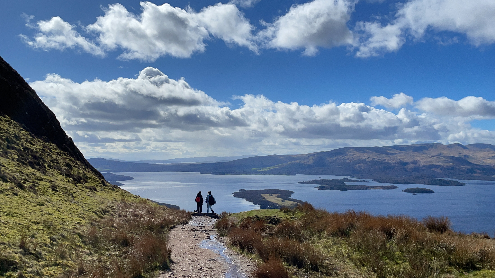
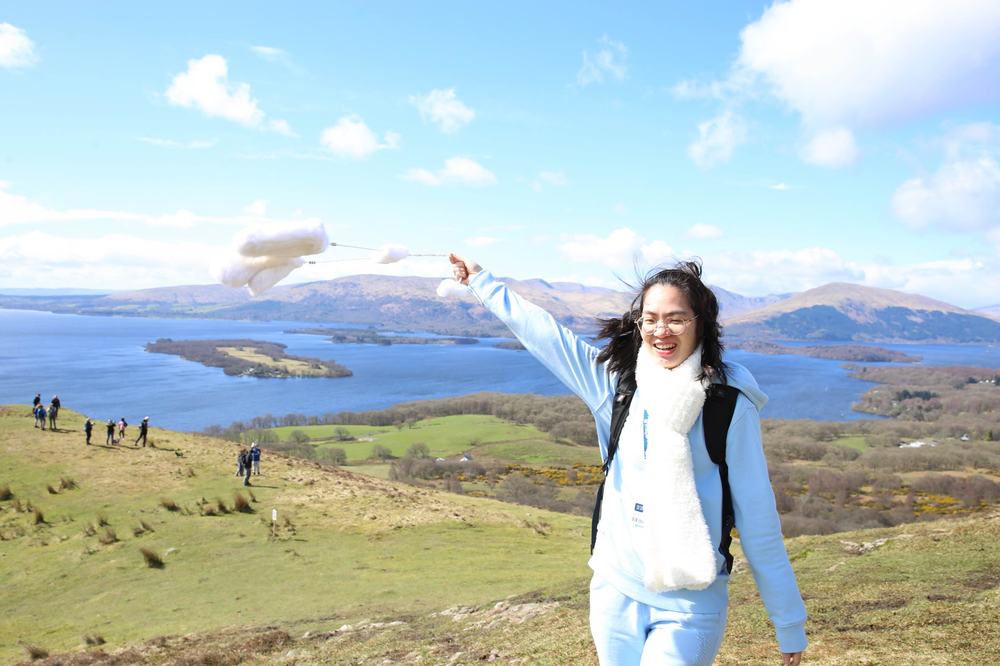
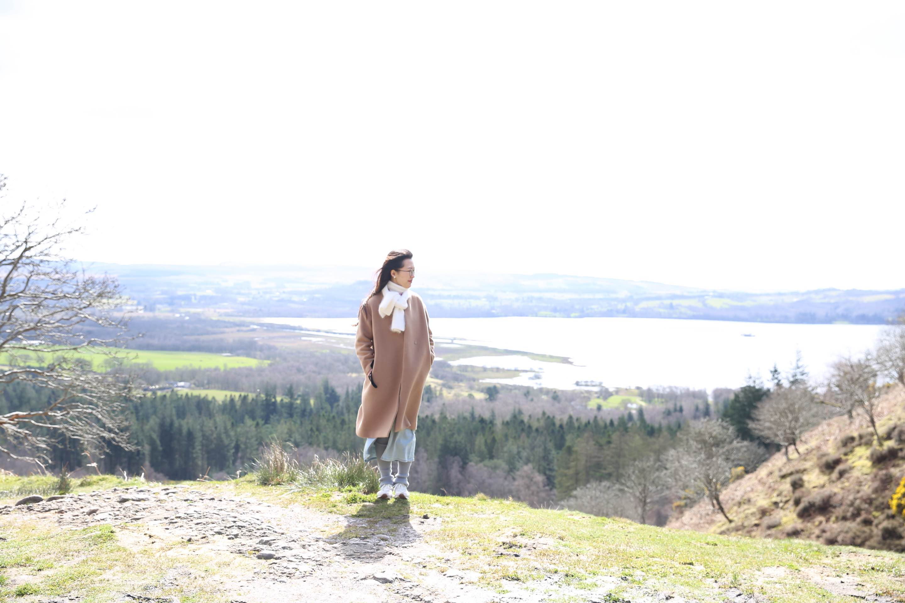

Conic hill simply offers the most spectacular views over Loch Lomond. It is also where you can experience how powerful winds in Scotland can be. 

## Quite a steep walk

{: width="90%"}

## Walk in a picture

{: width="90%"}

## Enjoy the scenary and enjoy the wind

{: width="90%"}

{: width="90%"}

