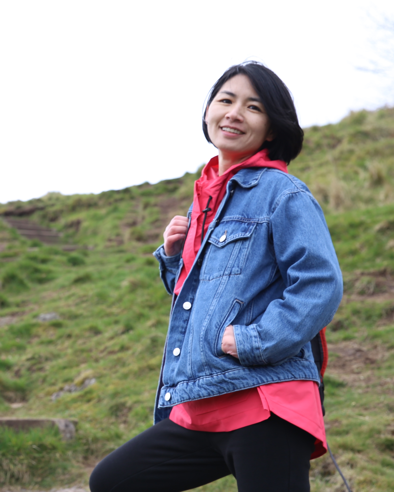

 {: style="float: left; margin-right: 10em"; width="45%"} 
 I am a Senior Lecturer (Associate Professor) in the School of Computer Science at the University of Glasgow, UK. Before I moved to Glasgow, I was an Associate Professor at Fudan University, Shanghai, China. I earned my Ph.D. at the University of California, Irvine, USA. in 2010.

My research involves understanding and designing technologies to promote individual and social well-being. I have looked into social-technical approaches to empowering people for effective health data engagement and health management, with a particular interest in everyday healthy living, mental well-being, and self-management of chronic diseases. Besides healthcare, I have also been studying aging, disability, and sustainability, and exploring approaches including social transparency, crowdsourcing, self-tracking, online community, mobile sharing, and others in relation to these issues. My goal is that computing technologies can be designed to unlock the potential of individuals, support collaborations, and create a positive societal impact. 

My research is generally in the areas of Human-Computer Interaction (HCI),  Computer Supported Cooperative Work (CSCW), and Ubiquitous Computing (Ubicomp). Specifically, I am working at the intersection of computer science and social science.  As computing technologies are increasingly woven into the fabric of everyday lives, we cannot easily separate technical problems from their social context anymore. By combining social and technical approaches, I hope to better understand computing technologies' roles and design technologies to fit into social practices.
 

