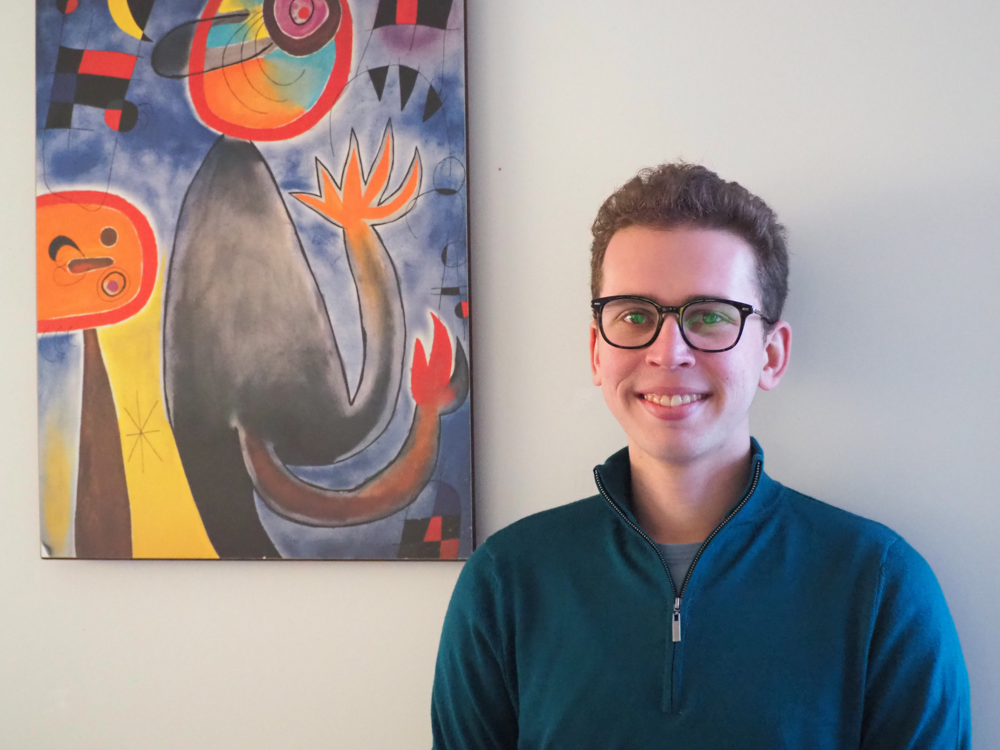

 
   

Hi, I'm Shakked! I'm currently a Predoctoral Research Fellow in the Economics Department at MIT, working for [Simon Jäger](https://economics.mit.edu/faculty/sjaeger) and [Benjamin Schoefer](https://eml.berkeley.edu/~schoefer/) on projects in labor economics. In fall 2022, I'll start a PhD in Economics at MIT.

I'm originally from New Zealand, where I studied economics, math, and philosophy at Victoria University of Wellington and worked at [Motu Economic and Public Policy Research](https://www.motu.nz/) before moving to MIT.

On this website, you can find my [research](http://shakkednoy.com/research/) and my [CV](http://shakkednoy.com/cv.pdf).

