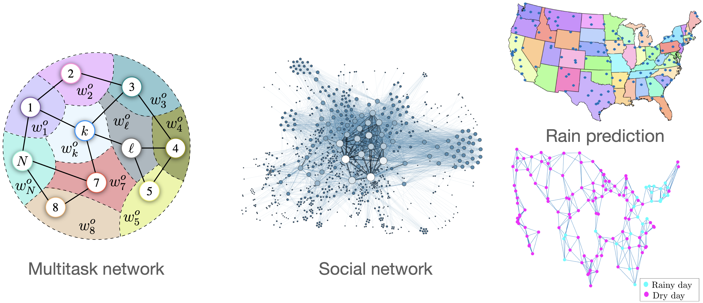

  
#### *CEDRO (Communication-Efficient Decentralized, Adaptive and Reliable Optimization over Multitask Graphs):*

CEDRO focuses on decentralized inference (stochastic optimization and learning) over graphs. The project recognizes that, in recent years, engineering systems are witnessing an increasing ability to collect data in decentralized and streamed manner. The focus will be on designing decentralized approaches where devices are collecting data in a continuous manner. The project also recognizes that modern machine learning applications (where large volumes of training data are generated continuously by a massive number of heterogeneous devices) have several key properties that differentiate them from standard distributed inference applications. Particular focus will be given to developing and studying approaches for decentralized learning in statistical heterogeneous (multitask) settings in the presence of limited communication resources and heterogeneous system devices. The project emphasis will specifically be on illustrating the interest of the proposed approaches in machine learning frameworks using publicly available datasets.

__*Funding agency:*__ Agence nationale de la recherche (ANR) - Jeunes Chercheuses et Jeunes Chercheurs (JCJC)

__*Starting date:*__ March 1, 2023

__*Duration:*__ 42 months

__*Future opportunities*:__ To complete the project, the following research positions will be available: 
  
* PhD position (starting date between April 1, 2023 and September 1, 2023, duration: 3 years, fully funded)
* Many internship positions for master students will also be available
  * Check the following [[link]](internship_nassif_i3s_2023.pdf) for an internship proposal for spring 2023 (duration 5 months)
* Postdoc position (duration 1 to 2 years)

If you have a strong analytical background, you are interested in topics related to machine learning, signal processing, stochastic optimization, decentralized processing, and data sciences, and you are keen to join our group at the I3S Laboratory in Nice, please contact me by sending your resume with copies of your academic transcripts.

To see what we are doing, you can check out the list of publications on my website.  

You can also check the following tutorial paper for a general overview:

R. Nassif, S. Vlaski, C. Richard, J. Chen, and A. H. Sayed, “Multitask Learning over Graphs: An Approach for Distributed, Streaming Machine Learning,” *IEEE Signal Processing Magazine*, vol. 37, no. 3, pp. 14-25, May 2020.[[arXiv]](https://arxiv.org/abs/2001.02112)

