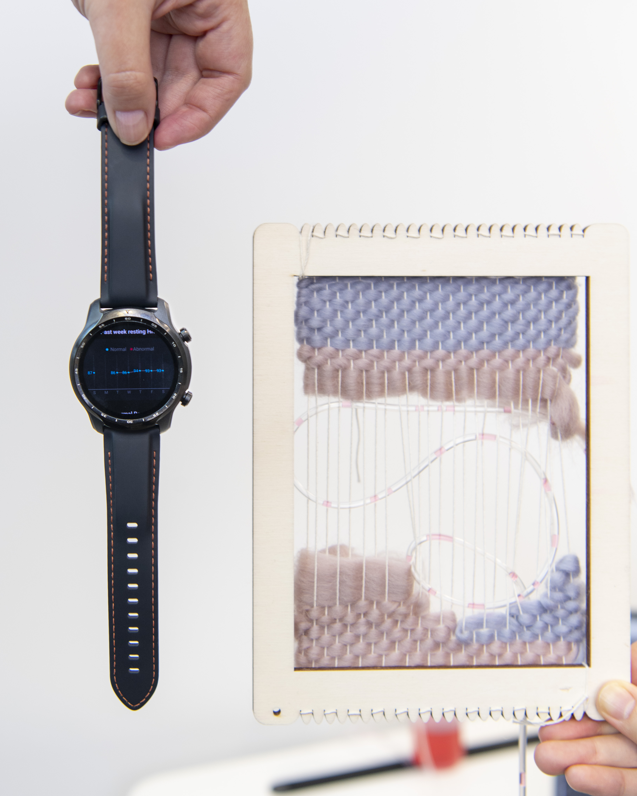

To give a sense of the kinds of research I am doing, here is some of my recent work, mainly on healthcare and peer interactions for personal growth and wellbeing, involving design, ethnographic studies, and technology development.{: width="20%"}{: style="float: right; margin-left: 3em;"} 

## Selected Publications

 - Wang, W. , **Ding, X. (S.)** and Hirskyj-Douglas, I., Everyday Space as an Interface for Health Data Engagement: Designing Tangible Displays of Stress Data. In: DIS '23: Designing Interactive Systems Conference, Pittsburgh, PA, USA, 10-14 July 2023, pp. 1648-1659. ISBN 9781450398930
 
 - **Ding, X. (S.)** , Tran, L. , Liu, Y. , O’Neill, C. and Lindsay, S., Infrastructural Work Behind The Scene: A Study of Formalized Peer-support Practices for Mental Health. In: 2023 CHI Conference on Human Factors in Computing Systems (CHI '23), Hamburg, Germany, 23-28 Apr 2023, p. 561. ISBN 9781450394215
   
 - **Ding, X.** , Kou, Y. , Xu, Y. and Zhang, P., "As Uploaders, We Have the Responsibility”: Individualized Professionalization of Bilibili Uploaders. In: 2022 ACM Conference on Human Factors in Computing Systems (CHI'22), New Orleans, LA, USA, 30 Apr - 05 May 2022, p. 509. ISBN 9781450391573

 - Jiang, Y. , **Ding, X.**, Ma, X. , Sun, Z. and Gu, N., IntimaSea: Exploring Shared Stress Display in Close Relationships. In: 2023 CHI Conference on Human Factors in Computing Systems (CHI '23), Hamburg, Germany, 23-28 Apr 2023, p. 428. ISBN 9781450394215

 - Jiang, Y. , **Ding, X.**, Liu, D. , Gui, X. , Zhang, W. and Zhang, W., Designing intelligent self-checkup based technologies for everyday healthy living. International Journal of Human-Computer Studies , 166, 	 102866.
 
 - **Ding, X.** , Wei, S. , Gui, X. , Gu, N. and Zhang, P.,  Data Engagement Reconsidered: a Study of Automatic Stress Tracking Technology in Use. In: 2021 CHI Conference on Human Factors in Computing Systems (CHI '21), 08-13 May 2021, p. 535. ISBN 9781450380966

 - You, Y. , Kou, Y. , **Ding, X.**  and Gui, X., The Medical Authority of AI: a Study of AI-enabled Consumer-Facing Health Technology. In: 2021 CHI Conference on Human Factors in Computing Systems (CHI '21), 08-13 May 2021, p. 207. ISBN 9781450380966
 
 - **Ding, X.** , Gui, X. , Ma, X. , Ding, Z. and Chen, Y., Getting the Healthcare We Want: the Use of Online "Ask the Doctor" Platforms in Practice. In: 2020 CHI Conference on Human Factors in Computing Systems (CHI '20), Honolulu, HI, USA, 25-30 Apr 2020, p. 570. ISBN 9781450367080
 
 - **Ding, X.** , Chen, Y. , Ding, Z. and Xu, Y., Boundary negotiation for patient-provider communication via Wechat in China. Proceedings of the ACM on Human-Computer Interaction , 3(CSCW), 	 157.

 - **Ding, X.** , Jiang, Y. , Qin, X. , Chen, Y. , Zhang, W. and Qi, L., Reading Face, Reading Health: Exploring Face Reading Technologies for Everyday Health. In: 2019 CHI Conference on Human Factors in Computing Systems (CHI '19), Glasgow, UK, 04-09 May 2019, p. 205. ISBN 9781450359702
