---
## Seminar
We organized our first image analysis seminar and a follow-up workshop on April 6th, 2022. 

Download <a href="/seminar_workkshop/Image analysis seminar_v10.pdf" download>Seminar Slides<a/>

---  
## Workshop
In this workshop, we will work through the following exercises:
1. Segmentation using global threshold, local threshold and Deep Learning (StarDist)
2. Cell tracking using StarDist and TrackMate
3. Denoising using Noise2Void
4. Bonus – 3D segmentation using StarDist and TrackMate

### Installing required plugins in Fiji
We will be adding the following three [updates sites](https://imagej.net/update-sites/following) in our Fiji to install all the required plugins for this workshop:   
- [CSBDeep](https://imagej.net/plugins/csbdeep)
- [StarDist](https://imagej.net/plugins/stardist)
- [TrackMate-StarDist](https://imagej.net/plugins/trackmate/trackmate-stardist)  
  
Step 1: Start Fiji.  
Step 2: Select Help > Update... from the menu bar.  
Step 3: Click on the button "Manage update sites".  
Step 4: Scroll down the list and tick the checkboxes for update sites: CSBDeep (shown below), StarDist and TrackMate-StarDist, then click the Close button.  
  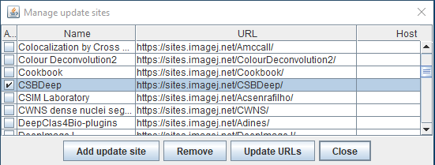  

Step 5: Click on "Apply changes" to install the plugins.  
Step 6: Restart Fiji. StarDist plugin should now be available under <code>Plugins > StarDist > StarDist 2D</code>.  
        Noise2Void plugin should be visible under <code>Plugins › CSBDeep › N2V</code>.
  
---

  
### Workshop Exercise 1: Segmentation
[Download TIF file](seminar_workkshop/images/HT29_nuclei.tif)  
Human HT29 colon cancer cells,  Image from [Broad Bioimage Benchmark Collection](https://bbbc.broadinstitute.org/BBBC008) 
  
#### Global segmentation  
Open above image by dragging it into the Fiji window and run Threshold command: <code>Image > Adjust > Threshold...</code>  
Choose different thresholding methods (such as Default, Huang, Otsu etc.) from the drop down list and check how well they perform on your image.  
Once satisfied with a particular method or by manually selecting the lower and upper threshold values (using sliders), click on the Apply button to generate a thresholded image.  

**Note**: All thresholding methods (such as Default, Huang, Otsu etc.) can be tested at once by using <code>Image > Adjust > Auto Threshold</code>  
  
#### Local segmentation  
Select your original image and run the command: <code>Image > Adjust > Auto Local Threshold</code>.  
Run with "Try all" methods to check which one gives the best result. For this image, the best segmentation is achieved with the <code>Phansalkar</code> method.  

#### Deep Learning based segmentation using [StarDist](https://imagej.net/plugins/stardist)  
Select your original image and run the command: <code>Plugins › StarDist › StarDist 2D</code>  
  In the follow up menu, choose Model: <code>Versatile (fluorescent nuclei)</code> and click on the <code>Set optimized thresholds</code> button at the bottom. Keep other settings as deafult. Click OK.  
A segmentation label image will be generated with the nuclei ROIs added to the ROI Manager.  

---  

  
### Workshop Exercise 2: Tracking cancer cell migration using [TrackMate](https://imagej.net/plugins/trackmate/) plugin  

  
Cancer cell migration, image from [Zenodo](https://doi.org/10.5281/zenodo.5206107).

[Download TIF file](seminar_workkshop/images/P31.tif)
  
- Open the above time-lapse sequence in Fiji and run the command: <code> Plugins › Tracking › TrackMate</code>  
- You will be presented with a <code>TrackMate</code> window. Click Next.  
- Select <code>StarDist detector</code> from the drop-down menu (image A below). Click next.  
- You can now click on the <code>Preview</code> tab, to check how well StarDist is detecting the nuclei on the current slice. If detections look fine, click next to detect nuclei in the whole time-lapse sequence.  
- Keep clicking next button until you reach the <code>Select a tracker</code> window. Select <code>Simple LAP tracker</code> and click next.  
  In the settings (image B below), choose Linking max distance=30 pixel, Gap-closing max distance=10 pixel, Gap-closing max frame gap=10. Click next.  

  **Note**: if you want to track splitting and/or merging events, then choose the <code>LAP tracker</code>, and tick the splitting/merging checkbox under settings.
- Keep clicking next until you reach the <code>Display options</code> window (image C below). Here, various display options for the tracks could be selected. Choose <code>Show tracks backward in time</code>. Play with different settings here and scroll through the stack to see the effect of these changes.  
  Please explore the three tabs at the bottom - <code>TrackScheme</code>, <code>Tracks</code> and <code>Spots</code>. A lot of statistics is hidden there, such as the raw values for each nuclei in each frame of the time-lapse. All the statistics could be exported to a CSV file.  
- Keep clicking next until you reach the last window called <code>Select an action</code>. Select <code>Capture overlay</code> and click <code>Execute</code> to generate a time-lapse movie with spots and tracks overlaid on top of the original data.  
- A label time-lapse movie could also be generated by selecting <code>Export label image</code> from the drop-down list and clicking <code>Execute</code>.  
  
| A | B | C |
| - | - | - | 
| 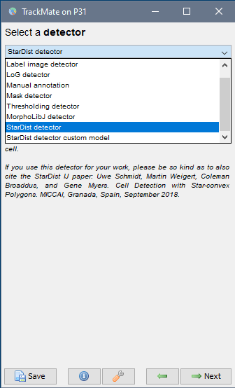 |  | 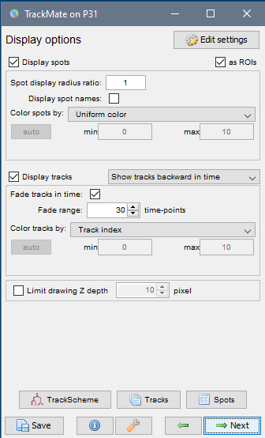 |

  
---

  
### Workshop Exercise 3: Denoising using [Noise2Void](https://imagej.net/plugins/n2v) plugin  

| Original | Noise2Void |
| - | - |
| 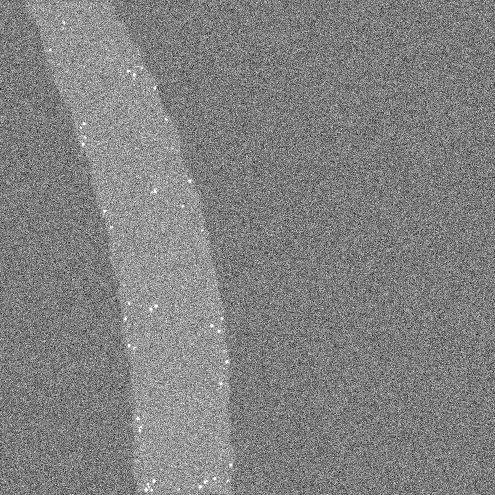 | 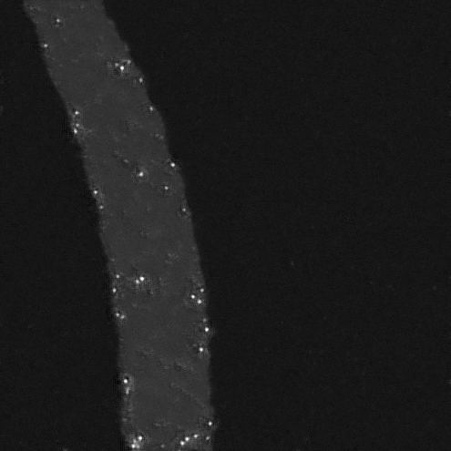 | 

FISH in C. elegans, Spinning disk confocal, image courtesy of [ABRF/LMRG Image Analysis Study](https://sites.google.com/view/lmrg-image-analysis-study).  

[Download TIF file](seminar_workkshop/images/fish4_celegans.tif)  
  
- Open the above Z-stack in Fiji and run the command: <code> Plugins › CSBDeep › N2V › N2V train + predict</code>  
- You will be presented with a <code>N2V train + predict</code> window. Choose the following options:
  - Axes of prediction input: XYZ
  - Number of epochs: 10
  - Number of steps per epoch: 10
  - Batch size per step: 64
  - Patch shape: 64
  - Neighborhood readius: 5
- Click OK. A window showing the progress of different steps (Preparation, Training and Prediction) will open. As the training progresses, training loss (red) and validation loss (blue) curves are displayed in the window (see below). If training goes well, then both the red and blue curves will decrease with more cycles (epochs) of training and stabilize around a minimum loss value (~ 1.0 in the image below). Training loss goes down from the beginning but Validation loss (blue curve) usually goes up in the beginning and then comes down and approaches the red curve.

  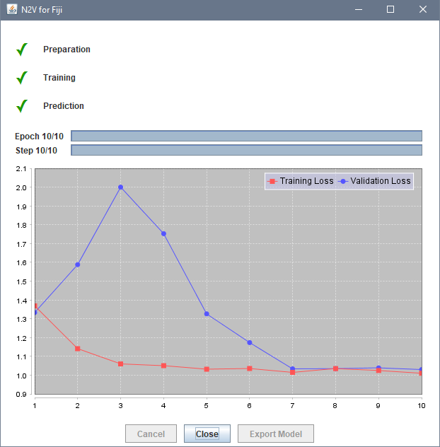
 
  If by the end of the training, red and blue curves do not stabilize to a minimum loss value, then increase the number of epochs to 20 or 30 and then run the command <code>N2V train + predict</code> again.
- After program finishes, it generates a denoised Z-stack from the trained model. You might need to run <code>Image › Adjust › Brightness/Contrast...</code> and hit <code>Reset</code> to adjust the display of the denoised image.
- The Deep Learning model you just trained could be saved as a .ZIP file (to be used for prediction in the future) by clicking on the <code>File actions > Save to...</code> (see below).
  
  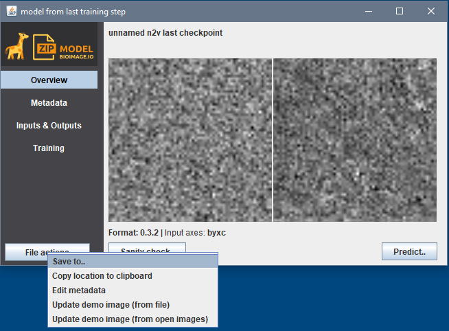
- Trained model could also be applied immediately on a single noisy image or a folder full of noisy images by using <code>Predict > Single image or stack</code> or <code>Predict > Folder of images of stacks</code>, respectively.  
  
  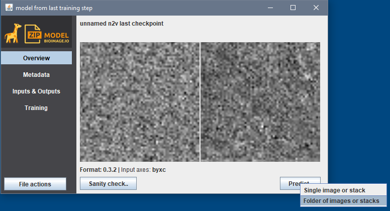
  
---

  
### Bonus Workshop Exercise 4: 3D segmentation using TrackMate (StarDist)

| Spheroid, Z-stack | Z-stack segmentation | 3D rendering |
| - | - | - |
|  | 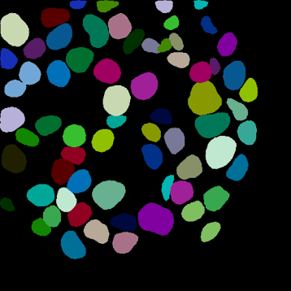 |  |

3D stack of cells in a spheroid from [Zenodo](https://doi.org/10.5281/zenodo.5220610).

[Download TIF file](seminar_workkshop/images/Spheroid-3D_8bit.tif)    
  
- Open above Z-stack in Fiji and run the <code>TrackMate</code> plugin, just like in exercise 2.
- Since this is a Z-stack and TrackMate works on a time-lapse sequence, we need to swap Z and T dimensions. TrackMate automatically detects it and asks for dimension swapping. Click Yes.   
  
  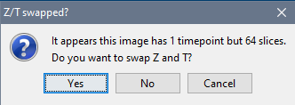
- For the detector, choose <code>StarDist</code> from the drop-down menu.  
- For the tracker, choose <code>Simple LAP tracker</code> and the following tracking settings:  
  Linking max distance=5 pixel (a lower value than in exercise 2, since the cells are not moving)  
  Gap-closing max distance=10 pixel  
  Gap-closing max frame gap=0. (since cells are not disappearing from frame-to-frame)  
- Keep clicking the next button until you reach the <code>Display options</code> window (image below). Choose:  
  Color spots by: Track index  
  Uncheck <code>Display tracks</code>    
  
  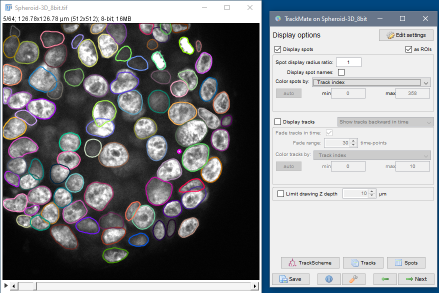
  
  Every cell will be outlined in a different color. Scroll through the stack to check the accuracy of the results. If results are not optimum, go back to the detection and/or tracker steps by clicking on the previous button (green left arrow) and changing the settings under detector and tracker.  
  
- On the last TrackMate window called <code>Select an action</code>, generate a label image by selecting <code>Export label image</code> from the drop-down list and clicking <code>Execute</code>. It will generate a grayscale Z-stack.    
- Apply colors to different cells by applying an LUT: <code>Image › Lookup Tables › glasbey_inverted</code>  
- For creating a 3D rendering, swap Z and T dimensions back to the original values by selecting <code>Image › Properties...</code> and entering Z=64 and T=1. Click OK. 
- Generate 3D rendering by using 3D viewer plugin: <code>Plugins › 3D Viewer</code>.
  Select <code>Resampling factor = 1</code>.  
  If a window pops up asking to convert the Z-stack to 8-bit or RGB image, click Yes.  
  In the ImageJ 3D Viewer window, use left mouse click and drag to rotate and inspect the volume.  

